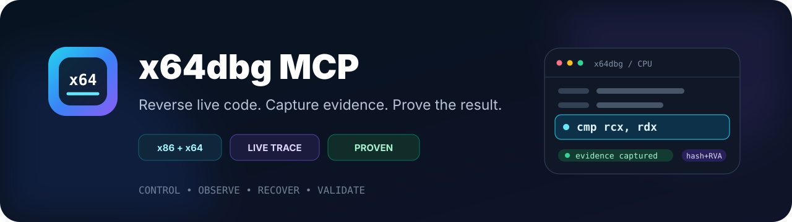

https://github.com/user-attachments/assets/07b813eb-4175-4f14-b21b-602548906398

<div align="center">



[](LICENSE)


[](https://github.com/rison1337/x64dbgMCP/actions/workflows/ci.yml)

<a name="en"></a>
<br>
<a href="#en"></a>
<a href="#ru"></a>

</div>

x64dbg MCP gives an MCP client guarded control of a real
[x64dbg](https://x64dbg.com/) or x32dbg session. It turns live debugging into a
replayable reverse-engineering workflow: bind the exact process, observe
runtime facts, recover useful artifacts, validate them independently, and hand
the evidence to IDA.

### What it does

- Launches or attaches with arguments, working directory, environment and
  child-process policy.
- Reads and changes registers, memory, threads, modules and owned breakpoints.
- Captures instruction, API, heap, exception and basic-block evidence.
- Finds comparison values, runtime strings, indirect calls, OEPs and imports.
- Produces memory PE dumps, minidumps, fixed imports and patched exports.
- Exchanges runtime facts with IDA using a portable **file SHA-256 + module RVA**
  identity instead of unstable runtime addresses.

### Tool groups

| Workflow | Representative tools | Result |
| --- | --- | --- |
| Launch and bind | `InitDebuggee`, `AttachToProcess`, `LaunchFileUnderDebugger`, `WaitForBreakpoint` | Reproducible process and session identity |
| Live control | `RegisterGet`, `RegisterSet`, `MemoryRead`, `MemoryWrite`, `DebugSetBreakpoint`, `SetHardwareBreakpoint` | Controlled execution, memory and breakpoint changes |
| Runtime evidence | `RunNativeTrace`, `GetNativeTrace`, `StartApiTrace`, `StartHeapTrace`, `GetBasicBlockCoverage`, `WaitForBreakpointCapture` | Instruction paths, API/heap calls, exceptions and executed blocks |
| Key and unpack recovery | `SearchStrings`, `ScanMemoryStrings`, `PatternFindMem`, `FindOEP`, `RunUntilOEP`, `FindIATCandidates`, `InspectRuntimeIAT` | Comparisons, strings, OEP and runtime import candidates |
| Dump and repair | `WriteMiniDump`, `DumpModuleRaw`, `DumpPeFromMemory`, `ScanMemoryForPEImages`, `FixDumpImports`, `ValidateDump`, `ExportPatchedFile` | Replayable dumps and independently checked PE artifacts |
| IDA evidence handoff | `ExportRuntimeEvidence`, `ImportStaticAnnotations`, `SyncBreakpoints`, `ResolveModuleRva` | Hash/RVA-addressed comments, labels, coverage and API facts |

The complete catalog, parameters and response contracts are in the
[tool reference](docs/TOOL_REFERENCE.md). The compact profile keeps routine
model-facing responses short; `detail="full"` and the `full` profile expose
the complete evidence when it is needed.

### Quick setup

Download the combined Windows bundle from
[Releases](https://github.com/rison1337/x64dbgMCP/releases). It contains both
native plugins and the Python backend:

- `plugins\MCPx64dbg.dp64` for x64dbg
- `plugins\MCPx64dbg.dp32` for x32dbg
- `runtime\src` and `runtime\requirements.txt`
- self-contained x64/x86 managed-runtime probes under `runtime\tools\bin\managed_probe`

Close x64dbg/x32dbg. Open PowerShell in the folder containing the downloaded
ZIP, then run the block below. It asks where to keep the MCP bundle and where
x64dbg is already installed; no drive or installation directory is assumed.
Keep the same PowerShell window open for the client-specific commands below.

```powershell
$Archive = Get-ChildItem -File .\x64dbg-mcp-windows-*.zip |
  Sort-Object LastWriteTime -Descending |
  Select-Object -First 1
if (-not $Archive) { throw 'The x64dbg MCP release ZIP was not found in this folder.' }

$BundleRoot = Read-Host 'Absolute folder where x64dbg MCP should be extracted'
$X64dbgRoot = Read-Host 'Absolute folder containing the x64 and x32 x64dbg folders'
$BundleRoot = [IO.Path]::GetFullPath(
  [Environment]::ExpandEnvironmentVariables($BundleRoot.Trim()))
$X64dbgRoot = (Resolve-Path -LiteralPath (
  [Environment]::ExpandEnvironmentVariables($X64dbgRoot.Trim()))).Path

if (-not (Test-Path -LiteralPath (Join-Path $X64dbgRoot 'x64\x64dbg.exe'))) {
  throw "x64dbg.exe was not found under $X64dbgRoot\x64"
}
if (-not (Test-Path -LiteralPath (Join-Path $X64dbgRoot 'x32\x32dbg.exe'))) {
  throw "x32dbg.exe was not found under $X64dbgRoot\x32"
}

Expand-Archive -LiteralPath $Archive.FullName -DestinationPath $BundleRoot -Force
Copy-Item (Join-Path $BundleRoot 'plugins\MCPx64dbg.dp64') `
  (Join-Path $X64dbgRoot 'x64\plugins\MCPx64dbg.dp64') -Force
Copy-Item (Join-Path $BundleRoot 'plugins\MCPx64dbg.dp32') `
  (Join-Path $X64dbgRoot 'x32\plugins\MCPx64dbg.dp32') -Force

$RuntimeRoot = Join-Path $BundleRoot 'runtime'
Set-Location $RuntimeRoot
py -3.11 -m venv .venv
.\.venv\Scripts\python.exe -m pip install -r requirements.txt

$PythonExe = (Resolve-Path .\.venv\Scripts\python.exe).Path
$Launcher = (Resolve-Path .\src\mcp_stdio_launcher.py).Path
[pscustomobject]@{
  PythonExe  = $PythonExe
  Launcher   = $Launcher
  X64dbgRoot = $X64dbgRoot
}
```

#### Codex

Add the server to `~\.codex\config.toml`. Replace the three angle-bracketed
values with the absolute paths printed by the setup block. TOML single-quoted
strings preserve Windows backslashes as written.

```toml
[mcp_servers.x64dbg]
command = '<PythonExe>'
args = ['<Launcher>']
startup_timeout_sec = 90

[mcp_servers.x64dbg.env]
X64DBG_ROOT = '<X64dbgRoot>'
X64DBG_MCP_TOOL_PROFILE = 'compact'
```

For normal target startup, call `InitDebuggee` directly with the EXE path. It
detects x86/x64, starts the matching debugger from `X64DBG_ROOT`, waits for the
bridge and opens the target. A separate `BridgeHello` preflight or manual
debugger-path search is not required.

Optional installation check: start x64dbg or x32dbg and verify the bridge:

```powershell
& $PythonExe (Join-Path $RuntimeRoot 'src\x64dbg.py') GetDebuggerPluginStatus
```

`GetScyllaHideStatus.installed` and `integrationReady` describe the MCP
InjectorCLI/HookLibrary backend. `guiPluginPresent` describes only the optional
x64dbg GUI plugin; it is not required for MCP injection.

#### Claude Code

Add the same stdio server to Claude Code with the user scope. This command uses
the paths selected by the setup block instead of embedding a machine-specific
location:

```powershell
$ClaudeServer = [ordered]@{
  command = $PythonExe
  args = @($Launcher)
  env = [ordered]@{
    X64DBG_ROOT = $X64dbgRoot
    X64DBG_MCP_TOOL_PROFILE = 'compact'
  }
} | ConvertTo-Json -Depth 4 -Compress
claude mcp add-json x64dbg $ClaudeServer --scope user
claude mcp list
```

Alternatively, run `claude mcp add` and enter the same command, arguments and
environment interactively.

#### Claude Desktop and other stdio clients

Use the client's MCP JSON configuration. For Claude Desktop on Windows, the
file is `%APPDATA%\Claude\claude_desktop_config.json`. Generate a JSON block
with the actual paths selected above:

```powershell
$ClientConfig = [ordered]@{
  mcpServers = [ordered]@{
    x64dbg = [ordered]@{
      command = $PythonExe
      args = @($Launcher)
      env = [ordered]@{
        X64DBG_ROOT = $X64dbgRoot
        X64DBG_MCP_TOOL_PROFILE = 'compact'
      }
    }
  }
}
$ClientConfig | ConvertTo-Json -Depth 6
```

Cursor, VS Code MCP, Windsurf and other stdio clients use the same
`command`/`args`/`env` contract; only the location of their JSON file differs.

### Build from source

```powershell
git clone https://github.com/rison1337/x64dbgMCP.git
Set-Location x64dbgMCP
cmake -S . -B build -DX64DBG_DOWNLOAD_SDK=ON
cmake --build build --target all_plugins --config Release

$X64dbgRoot = (Resolve-Path -LiteralPath (Read-Host 'x64dbg installation folder')).Path
Copy-Item build\build64\Release\MCPx64dbg.dp64 `
  (Join-Path $X64dbgRoot 'x64\plugins\MCPx64dbg.dp64') -Force
Copy-Item build\build32\Release\MCPx64dbg.dp32 `
  (Join-Path $X64dbgRoot 'x32\plugins\MCPx64dbg.dp32') -Force
```

### IDA Pro MCP Fusion handoff

The IDA workflow is designed for the
[rison1337/ida-pro-mcp-fusion](https://github.com/rison1337/ida-pro-mcp-fusion)
fork. x64dbg MCP does not pretend to be an IDA replacement and does not
silently mutate an unrelated database. Instead:

1. `ExportRuntimeEvidence` writes a versioned evidence document containing the
   target SHA-256, architecture, module RVAs, executed blocks, API calls,
   comments, labels and functions.
2. `ResolveModuleRva` and the coordinator normalize live addresses to the
   static image identity.
3. `tools/ida_evidence_coordinator.py` validates that the open Fusion database
   has the same SHA-256 and architecture, then creates deterministic
   `set_name`, `set_comments`, `define_func` and coverage/API comment actions.
4. Fusion applies those actions in its IDA worker and can retain the result in
   its persistent SQLite cache for later multi-binary analysis.

This is an explicit artifact/protocol handoff, so it remains inspectable and
retryable. See the
[coordinator](tools/ida_evidence_coordinator.py) and the
[Fusion README](https://github.com/rison1337/ida-pro-mcp-fusion#english) for
the IDA-side worker and cache model.

### Documentation

- [Tool reference](docs/TOOL_REFERENCE.md)
- [Security model](SECURITY.md)
- [Contributing](CONTRIBUTING.md)

CI covers the Python contract and both native plugin architectures. The release
workflow also checks the packaged stdio server and managed probes. Live debugger
gates run locally and retain JSON reports; see [Contributing](CONTRIBUTING.md).
Analyze untrusted binaries inside a disposable VM.

GPL-3.0. Based on
[x64dbgMCP by Sam W (Wasdubya)](https://github.com/Wasdubya/x64dbgMCP).
See [NOTICE](NOTICE) for attribution.

---

<a name="ru"></a>
<br>

<div align="center">

<a href="#en"></a>
<a href="#ru"></a>

</div>

x64dbg MCP даёт MCP-клиенту защищённое управление настоящей сессией
[x64dbg](https://x64dbg.com/) или x32dbg. Он превращает живую отладку в
воспроизводимый reverse-engineering workflow: привязать точный процесс,
снять runtime-факты, восстановить полезные артефакты, независимо проверить
результат и передать факты в IDA.

### Возможности

- Запуск и attach с аргументами, cwd, окружением и политикой дочерних
  процессов.
- Регистры, память, потоки, модули и breakpoint'ы с контролем владельца.
- Instruction-, API-, heap-, exception-trace и basic-block evidence.
- Поиск сравнений, runtime-строк, косвенных вызовов, OEP и импортов.
- PE из памяти, minidump, исправление IAT и экспорт пропатченного файла.
- Обмен с IDA через переносимую связку **SHA-256 файла + module RVA**, а не
  случайный runtime VA.

### Группы инструментов

| Этап | Примеры MCP tools | Что получается |
| --- | --- | --- |
| Запуск и привязка | `InitDebuggee`, `AttachToProcess`, `LaunchFileUnderDebugger`, `WaitForBreakpoint` | Воспроизводимый процесс и точная session identity |
| Управление | `RegisterGet`, `RegisterSet`, `MemoryRead`, `MemoryWrite`, `DebugSetBreakpoint`, `SetHardwareBreakpoint` | Контролируемый run/step, память и breakpoint'ы |
| Runtime evidence | `RunNativeTrace`, `GetNativeTrace`, `StartApiTrace`, `StartHeapTrace`, `GetBasicBlockCoverage`, `WaitForBreakpointCapture` | Пути инструкций, API/heap, исключения и выполненные блоки |
| Поиск ключей и unpack | `SearchStrings`, `ScanMemoryStrings`, `PatternFindMem`, `FindOEP`, `RunUntilOEP`, `FindIATCandidates`, `InspectRuntimeIAT` | Сравнения, строки, OEP и кандидаты runtime-IAT |
| Дамп и восстановление | `WriteMiniDump`, `DumpModuleRaw`, `DumpPeFromMemory`, `ScanMemoryForPEImages`, `FixDumpImports`, `ValidateDump`, `ExportPatchedFile` | Повторяемые дампы и проверенные PE-артефакты |
| Передача в IDA | `ExportRuntimeEvidence`, `ImportStaticAnnotations`, `SyncBreakpoints`, `ResolveModuleRva` | Комментарии, labels, coverage и API-факты по hash/RVA |

Полный каталог, параметры и контракты ответов находятся в
[справочнике инструментов](docs/TOOL_REFERENCE.md). Профиль `compact` делает
обычные ответы короткими; `detail="full"` и профиль `full` возвращают всё
доказательство.

### Быстрая настройка

Скачайте из [Releases](https://github.com/rison1337/x64dbgMCP/releases) единый
Windows-архив. Внутри сразу есть оба native-плагина и Python-backend:

- `plugins\MCPx64dbg.dp64` для x64dbg
- `plugins\MCPx64dbg.dp32` для x32dbg
- `runtime\src` и `runtime\requirements.txt`
- автономные x64/x86 managed-runtime probes в `runtime\tools\bin\managed_probe`

Закройте x64dbg/x32dbg. Откройте PowerShell в папке со скачанным ZIP и
выполните блок ниже. Он сам запросит папку для MCP и путь к уже установленному
x64dbg — диск и расположение заранее не предполагаются. Не закрывайте это окно
PowerShell до выполнения команд для выбранного MCP-клиента.

```powershell
$Archive = Get-ChildItem -File .\x64dbg-mcp-windows-*.zip |
  Sort-Object LastWriteTime -Descending |
  Select-Object -First 1
if (-not $Archive) { throw 'Архив релиза x64dbg MCP не найден в этой папке.' }

$BundleRoot = Read-Host 'Полный путь к папке, куда распаковать x64dbg MCP'
$X64dbgRoot = Read-Host 'Полный путь к папке x64dbg, содержащей каталоги x64 и x32'
$BundleRoot = [IO.Path]::GetFullPath(
  [Environment]::ExpandEnvironmentVariables($BundleRoot.Trim()))
$X64dbgRoot = (Resolve-Path -LiteralPath (
  [Environment]::ExpandEnvironmentVariables($X64dbgRoot.Trim()))).Path

if (-not (Test-Path -LiteralPath (Join-Path $X64dbgRoot 'x64\x64dbg.exe'))) {
  throw "x64dbg.exe не найден в $X64dbgRoot\x64"
}
if (-not (Test-Path -LiteralPath (Join-Path $X64dbgRoot 'x32\x32dbg.exe'))) {
  throw "x32dbg.exe не найден в $X64dbgRoot\x32"
}

Expand-Archive -LiteralPath $Archive.FullName -DestinationPath $BundleRoot -Force
Copy-Item (Join-Path $BundleRoot 'plugins\MCPx64dbg.dp64') `
  (Join-Path $X64dbgRoot 'x64\plugins\MCPx64dbg.dp64') -Force
Copy-Item (Join-Path $BundleRoot 'plugins\MCPx64dbg.dp32') `
  (Join-Path $X64dbgRoot 'x32\plugins\MCPx64dbg.dp32') -Force

$RuntimeRoot = Join-Path $BundleRoot 'runtime'
Set-Location $RuntimeRoot
py -3.11 -m venv .venv
.\.venv\Scripts\python.exe -m pip install -r requirements.txt

$PythonExe = (Resolve-Path .\.venv\Scripts\python.exe).Path
$Launcher = (Resolve-Path .\src\mcp_stdio_launcher.py).Path
[pscustomobject]@{
  PythonExe  = $PythonExe
  Launcher   = $Launcher
  X64dbgRoot = $X64dbgRoot
}
```

#### Codex

Добавьте сервер в `~\.codex\config.toml`. Замените три значения в угловых
скобках на абсолютные пути, которые напечатал блок настройки. В одинарных
строках TOML обратные слеши Windows не нужно удваивать.

```toml
[mcp_servers.x64dbg]
command = '<PythonExe>'
args = ['<Launcher>']
startup_timeout_sec = 90

[mcp_servers.x64dbg.env]
X64DBG_ROOT = '<X64dbgRoot>'
X64DBG_MCP_TOOL_PROFILE = 'compact'
```

Для обычного запуска цели сразу вызовите `InitDebuggee` с путём к EXE.
Инструмент сам определит x86/x64, запустит подходящий debugger из
`X64DBG_ROOT`, дождётся bridge и откроет цель. Отдельная проверка через
`BridgeHello` и ручной поиск пути к x64dbg не нужны.

Необязательная проверка установки: запустите x64dbg или x32dbg и проверьте
bridge:

```powershell
& $PythonExe (Join-Path $RuntimeRoot 'src\x64dbg.py') GetDebuggerPluginStatus
```

Поля `GetScyllaHideStatus.installed` и `integrationReady` относятся к backend
на базе InjectorCLI, HookLibrary и profile INI. `guiPluginPresent` сообщает
только о необязательном GUI-плагине x64dbg; для MCP-инъекции он не требуется.

#### Claude Code

Добавьте тот же stdio-сервер в Claude Code с областью пользователя. Команда
использует выбранные выше пути, а не расположение с чужого компьютера:

```powershell
$ClaudeServer = [ordered]@{
  command = $PythonExe
  args = @($Launcher)
  env = [ordered]@{
    X64DBG_ROOT = $X64dbgRoot
    X64DBG_MCP_TOOL_PROFILE = 'compact'
  }
} | ConvertTo-Json -Depth 4 -Compress
claude mcp add-json x64dbg $ClaudeServer --scope user
claude mcp list
```

Либо запустите `claude mcp add` и введите те же command, args и env
интерактивно.

#### Claude Desktop и другие stdio-клиенты

Используйте JSON-конфигурацию MCP вашего клиента. В Claude Desktop на Windows
это `%APPDATA%\Claude\claude_desktop_config.json`. Сформируйте JSON с реально
выбранными путями:

```powershell
$ClientConfig = [ordered]@{
  mcpServers = [ordered]@{
    x64dbg = [ordered]@{
      command = $PythonExe
      args = @($Launcher)
      env = [ordered]@{
        X64DBG_ROOT = $X64dbgRoot
        X64DBG_MCP_TOOL_PROFILE = 'compact'
      }
    }
  }
}
$ClientConfig | ConvertTo-Json -Depth 6
```

Cursor, VS Code MCP, Windsurf и другие stdio-клиенты используют тот же
контракт `command`/`args`/`env`; отличается только путь к JSON-файлу.

### Сборка из исходников

```powershell
git clone https://github.com/rison1337/x64dbgMCP.git
Set-Location x64dbgMCP
cmake -S . -B build -DX64DBG_DOWNLOAD_SDK=ON
cmake --build build --target all_plugins --config Release

$X64dbgRoot = (Resolve-Path -LiteralPath (Read-Host 'Папка установки x64dbg')).Path
Copy-Item build\build64\Release\MCPx64dbg.dp64 `
  (Join-Path $X64dbgRoot 'x64\plugins\MCPx64dbg.dp64') -Force
Copy-Item build\build32\Release\MCPx64dbg.dp32 `
  (Join-Path $X64dbgRoot 'x32\plugins\MCPx64dbg.dp32') -Force
```

### Синхронизация с IDA Pro MCP Fusion

Связка рассчитана именно на
форк [rison1337/ida-pro-mcp-fusion](https://github.com/rison1337/ida-pro-mcp-fusion#english).
x64dbg MCP не подменяет IDA и не пишет в случайную базу:

1. `ExportRuntimeEvidence` сохраняет версионированный JSON с SHA-256 цели,
   архитектурой, module RVA, выполненными блоками, API-вызовами, labels,
   comments и функциями.
2. `ResolveModuleRva` и coordinator переводят runtime-адреса в координаты
   статического образа.
3. `tools/ida_evidence_coordinator.py` сверяет SHA-256 и архитектуру открытой
   Fusion-базы и строит детерминированные действия `set_name`,
   `set_comments`, `define_func` и комментарии coverage/API.
4. Fusion применяет действия в своём IDA worker и может сохранить результат в
   persistent SQLite cache для следующих multi-binary исследований.

Это явный, проверяемый и повторяемый artifact/protocol handoff, а не скрытая
связь по нестабильным VA. Подробности: [coordinator](tools/ida_evidence_coordinator.py)
и [README Fusion](https://github.com/rison1337/ida-pro-mcp-fusion#english).

### Документация

- [Справочник инструментов](docs/TOOL_REFERENCE.md)
- [Модель безопасности](SECURITY.md)
- [Участие в разработке](CONTRIBUTING.md)

CI проверяет Python-контракт и native-плагины обеих архитектур. Release workflow
также проверяет stdio-сервер и managed probes из собранного архива. Live-проверки
debugger выполняются локально и сохраняют JSON-отчёты; см. [участие в разработке](CONTRIBUTING.md).
Неизвестные бинарники анализируйте в одноразовой VM.

GPL-3.0. Проект основан на
[x64dbgMCP Sam W (Wasdubya)](https://github.com/Wasdubya/x64dbgMCP).
Атрибуция: [NOTICE](NOTICE).
